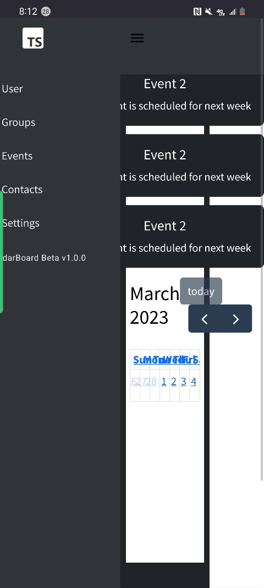

<h1 align="center" font-size="40px">
     CalendarBoard 🏫📆
</h1>


**CalendarBoard** is a lightweight, personal planner that allows users to manage their own schedule, compare schedules with other users, and manage privacy settings. Users can also create organizations/groups, schedule meetings within it, and manage the privacy and permissions of it. The app is meant to be a rich environment for specific people - say students, faculty, gamers, friends, and more to quickly see what's going on and get connected. You can come here to see whatever group or organization you're part of is up to and get resources on the spot. 

## ➡️Timeline + Context 

This is our senior project and we will spend our entire senior year making it come to life. The first semester of our 2023 year was used for designing and the second for implementation. We meet twice a week as a group and spend as much time as possible outside working on this. Our goal is to have a complete working version per our design before May 14th, 2023 (our graduation date) and go from there. There might be some interest to keep this up and working after that but this depends on the traction the project picks up once live and available to the public. 

## ➡️Latest Demo

Here is a quick sneak peak of our on-going `dev` branch. Although the web app is optimized for desktop we are making efforts to make it as mobile friendly as possible. 



## ➡️Running the project

You will need to get a copy of the repo (either downloading it or cloning) and you will need Node.js and NPM. Once you have all of those then you can simply open the project in your editor of choice, and run it(with `npm start`)! 

## ➡️Design / Wireframes 

[Here](https://www.figma.com/file/vm8PMaFIeM1dCKj6hkVNI1/CalenderBoard-Wireframe?node-id=0%3A1&t=aJXAEClEpfCicW7o-1) is the design of the project. 

## ➡️Authors + Copyright 

Here is all the lovely people that help put this together, and a few words on copyright. 

### Authors 


[Stephane K](https://github.com/stephaneK123)

[David](https://github.com/Risemon2)

[Logan](https://github.com/alumnu) 

[Chris](https://github.com/anxelic)

[Kerrybeth](https://github.com/gerrykorman)

### Copyright

As of right now, not too many concerns on copyright. Please don't steal any of our ideas or software, and if you do at least give credit or something! This is not ever intended for actual use and mostly for educational purposes! 

```Permission is hereby granted, free of charge, to any person obtaining a copy of this software and associated documentation files (the "Software"), to deal in the Software without restriction, including without limitation the rights to use, copy, modify, merge, publish, distribute, sublicense, and/or sell copies of the Software, and to permit persons to whom the Software is furnished to do so, subject to the following conditions:``` 

```The above copyright notice and this permission notice shall be included in all copies or substantial portions of the Software.```

```THE SOFTWARE IS PROVIDED "AS IS", WITHOUT WARRANTY OF ANY KIND, EXPRESS OR IMPLIED, INCLUDING BUT NOT LIMITED TO THE WARRANTIES OF MERCHANTABILITY, FITNESS FOR A PARTICULAR PURPOSE AND NONINFRINGEMENT. IN NO EVENT SHALL THE AUTHORS OR COPYRIGHT HOLDERS BE LIABLE FOR ANY CLAIM, DAMAGES OR OTHER LIABILITY, WHETHER IN AN ACTION OF CONTRACT, TORT OR OTHERWISE, ARISING FROM, OUT OF OR IN CONNECTION WITH THE SOFTWARE OR THE USE OR OTHER DEALINGS IN THE SOFTWARE.```

Copyright (c) Jan 2023 
